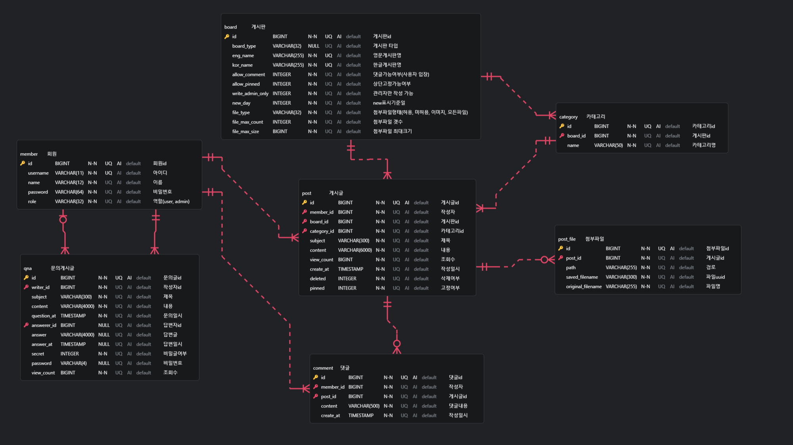

# 통합형 게시판 프로젝트

SpringBoot 기반 REST API 서버와 Next.js SPA, Thymeleaf MPA를 조합한 통합형 게시판 프로젝트입니다.  
사용자 영역과 관리자 영역을 분리하여 실무에 가까운 아키텍처로 설계 및 구현하였습니다.

---

## 프로젝트 구성

| 모듈 | 설명 | GitHub |
|------|------|--------|
| 사용자 API | 게시판, 댓글, Q&A 등 API 제공 (SpringBoot) | [board-v4](https://github.com/DNGHKM/board-v4) |
| 사용자 프론트엔드 | 게시판 SPA 프론트엔드 (Next.js) | [board-v4-front](https://github.com/DNGHKM/board-v4-front) |
| 관리자 서비스 | 게시판 관리 기능 제공 (SpringBoot + Thymeleaf 기반 MPA) | [board-v4-admin](https://github.com/DNGHKM/board-v4-admin) |

---

## 사용 기술

**Backend**
- Java 21, SpringBoot, MyBatis
- RESTful API, Swagger

**Frontend**
- 사용자: Next.js (Pages Router), React, Material UI
- 관리자: Thymeleaf, Bootstrap 5

**Database**
- MySQL

---

## 주요 기능

### 사용자 영역 (API + SPA)

- 게시글 목록, 상세, 검색, 정렬, 페이징
- 게시글 작성, 수정, 삭제
- 댓글 작성/삭제
- Q&A 비공개 문의 및 비밀번호 인증
- 게시판별 정책 분기 (댓글 허용, 파일 첨부 제한 등)

### 관리자 영역 (MPA)

- 관리자 로그인 및 세션 관리
- 게시판 생성 및 정책 설정
- 게시글/댓글/Q&A 관리
- 고정글, 비공개글, 관리자 전용 게시판 설정

---

## ERD

- 게시판 유형(board_type)에 따라 기능 정책 분리
- 첨부파일, 카테고리, Q&A 관리 등 세분화된 설계
  
---
# 사용자 서비스 API 명세
> 전체 API 명세는 Swagger 기반으로 구성되어 있으며, 다음은 주요 엔드포인트 요약입니다.  
> 상세한 요청/응답 구조는 Swagger UI 참고

<strong>인증 API</strong>

| Method | URL              | 설명            |
|--------|------------------|---------------|
| POST   | /api/auth/login  | 사용자 로그인       |
| GET    | /api/auth/check  | 유저명 중복 확인     |
| GET    | /api/auth/me     | 토큰 기반 유저정보 확인 |
| POST   | /api/auth/logout | 로그아웃          |

<strong>게시글 API</strong>

| Method | URL                        | 설명               |
|--------|----------------------------|--------------------|
| GET    | /api/posts                 | 게시글 목록 조회     |
| GET    | /api/posts/{id}           | 게시글 상세 조회     |
| POST   | /api/posts                 | 게시글 작성         |
| PUT    | /api/posts/{id}           | 게시글 수정         |
| DELETE | /api/posts/{id}           | 게시글 삭제         |
| POST   | /api/posts/password-check | 비회원 비밀번호 확인 |

<strong>댓글 API</strong>

| Method | URL                      | 설명         |
|--------|--------------------------|--------------|
| GET    | /api/comments/{postId}   | 댓글 목록 조회 |
| POST   | /api/comments            | 댓글 작성     |
| DELETE | /api/comments/{id}       | 댓글 삭제     |

<strong>게시판/카테고리 API</strong>

| Method | URL                         | 설명                     |
|--------|-----------------------------|--------------------------|
| GET    | /api/boards                 | 게시판 목록 조회           |
| GET    | /api/boards/{id}            | 게시판 상세 조회           |
| GET    | /api/categories/{boardId}   | 특정 게시판의 카테고리 목록 |

<strong>Q&A (1:1 문의) API</strong>

| Method | URL           | 설명         |
|--------|---------------|--------------|
| POST   | /api/qna      | Q&A 작성      |
| GET    | /api/qna/{id} | Q&A 상세 조회 |
| PUT    | /api/qna/{id} | Q&A 수정      |
| DELETE | /api/qna/{id} | Q&A 삭제      |

<strong>파일 API</strong>

| Method | URL                    | 설명             |
|--------|------------------------|------------------|
| POST   | /api/upload            | 파일 업로드       |
| GET    | /api/files/{filename}  | 파일 다운로드     |

